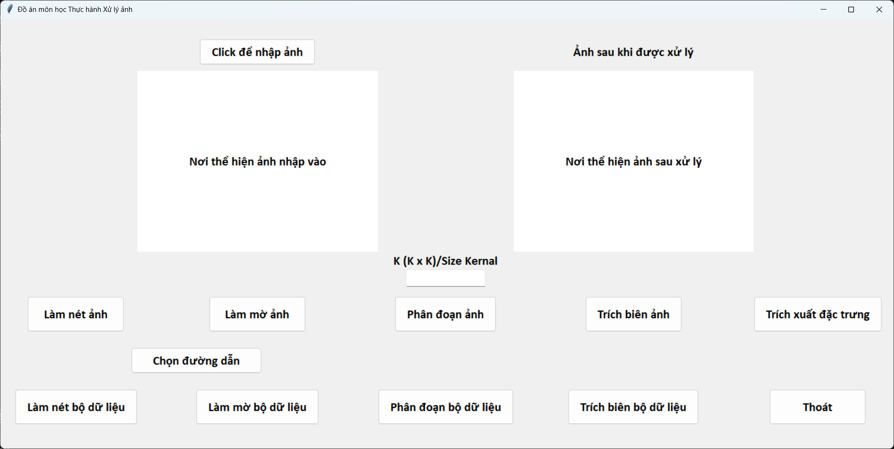

# Image Processing with GUI
 Sharpen, Blurred, Segmentation, Boundary Extraction, Feature Extraction by many techniques with GUI   
 
 Files:
  - image_processing.py (source code)   
  
 How to use:
 -  Clone and run image_processing.py 
 -  Type the size of kernal you need and choose the image to process 
 -  (Dataset must save in the *Data* folder)
 -  Click the button to execute, processed image will be save into the current folder of project.  
 

